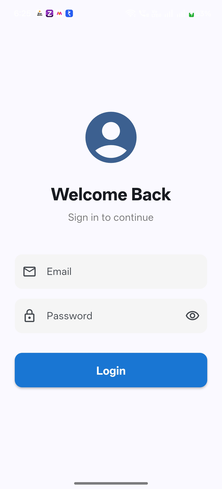
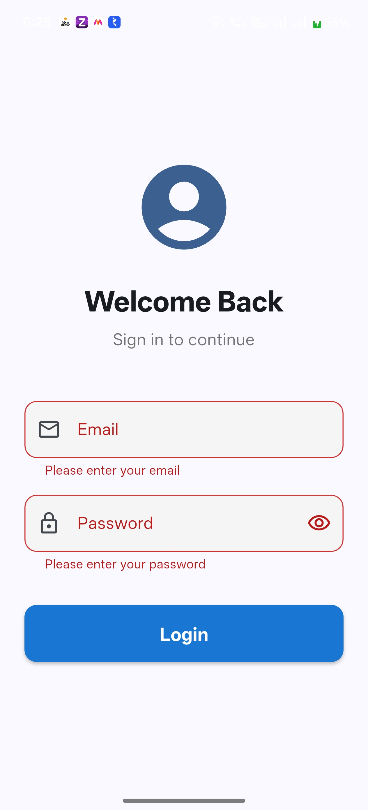
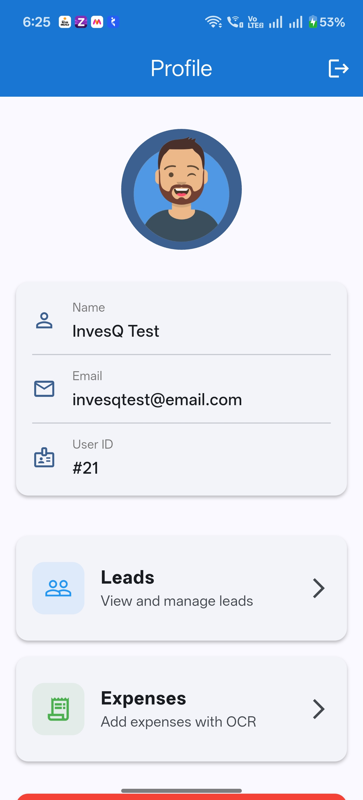
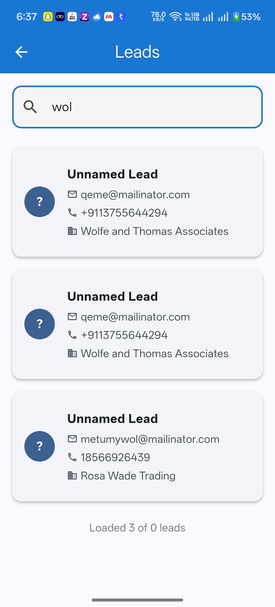
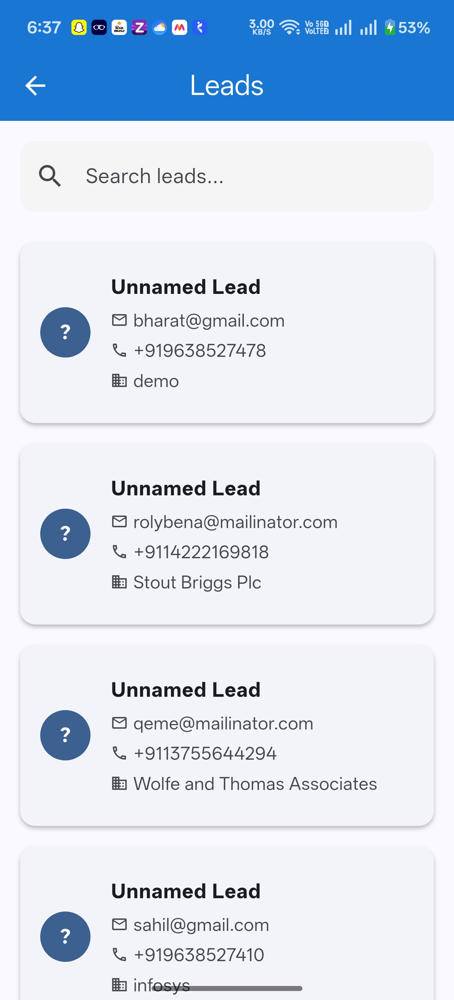
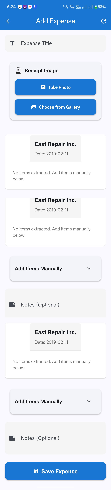
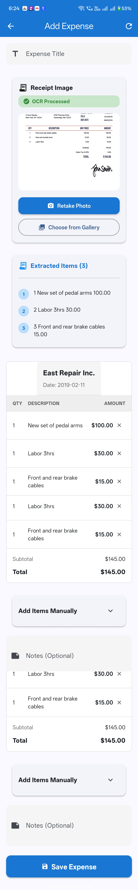
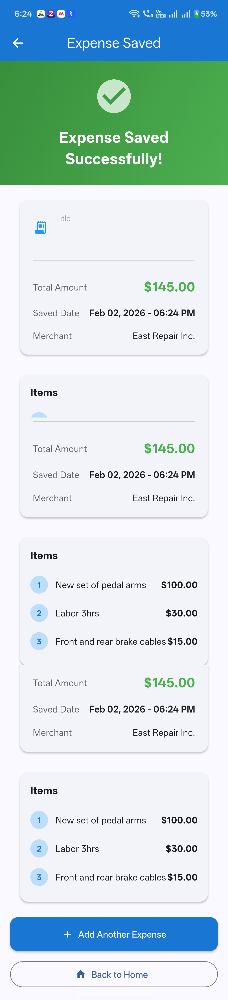

# InvesQ Practical - Flutter Mobile Application

A professional mobile application built with Flutter featuring authentication, profile management, lead listing with search and pagination, and OCR-powered expense tracking.

## 🚀 Features

### 1. **Login Screen**
- Clean and modern UI design
- Email and password validation
- Secure token storage using `flutter_secure_storage`
- Loading indicators and error handling
- Auto-filled test credentials for easy testing

### 2. **Profile Page**
- Display user information (name, email, ID)
- Avatar support with placeholder
- Logout functionality with confirmation dialog
- Navigation to Leads and Expenses features

### 3. **Leads Listing**
- Paginated list of leads with infinite scroll
- Real-time search functionality (filters by name, email, company, phone)
- Pull-to-refresh support
- Beautiful card-based UI with status badges
- Displays lead details (name, email, phone, company, status)
- Loading states and error handling

### 4. **OCR Expense Form**
- **Image Selection**: Camera and gallery image picker with image compression (max 1920x1920, 85% quality)
- **Receipt Processing**: 
  - Automatic text extraction from receipts using Google ML Kit Text Recognition
  - Intelligent OCR processing dialog with progress indicator
  - Data extraction with regex pattern matching for robust results
- **Auto-Extracted Fields**:
  - **Date**: Extracts and formats dates in MMM dd, yyyy format
  - **Merchant**: Intelligent merchant/vendor name extraction
  - **Items**: Automatic itemized list extraction with descriptions and prices
- **Form Features**:
  - Manual expense entry with title, amount, and notes
  - Receipt image preview section showing extracted data
  - Multiple expense categories (Food, Travel, Entertainment, Office Supplies, Other)
  - Date picker with calendar integration
  - Manual item addition form for supplements/modifications
  - Itemized expense tracking with individual item editing
- **User-Friendly UX**:
  - Clear OCR opt-in dialog before processing
  - Visual feedback during OCR processing
  - Automatic item parsing with price extraction
  - Item quantity and description support
  - No auto-fill of title/amount - user enters these manually
  - Receipt data display for reference

## 📱 Screenshots

### App Feature Screens

| Sign In | Sign In Error | Profile |
|:---:|:---:|:---:|
|  |  |  |

| Search Leads List| Leads List | Add Expense (Step 1) |
|:---:|:---:|:---:|
|  |  |  |

| Add Expense (Step 2) | Expense Saved | Receipt Template |
|:---:|:---:|:---:|
|  |  |  |

### App Features Demonstrated
- ✅ Sign in with secure token storage & error handling
- ✅ Profile page with user information and logout
- ✅ Leads listing with search and pagination
- ✅ OCR expense form with receipt scanning
- ✅ Automatic item extraction from receipts
- ✅ Expense confirmation screen with saved timestamp

## 🏗️ Architecture

### Clean Architecture Pattern

```
lib/
├── core/
│   ├── constants/           # API URLs, app constants
│   ├── theme/              # App theme and styling
│   ├── utils/              # Utility classes (SecureStorage)
│   └── widgets/            # Reusable widgets
├── features/
│   ├── auth/               # Authentication feature
│   │   ├── data/
│   │   │   ├── models/     # User, LoginResponse models
│   │   │   └── repositories/  # AuthRepository
│   │   └── presentation/
│   │       ├── providers/  # AuthProvider (state management)
│   │       └── screens/    # LoginScreen
│   ├── profile/            # Profile feature
│   ├── leads/              # Leads feature
│   └── expense/            # Expense + OCR feature
└── main.dart
```

### Key Architecture Decisions

1. **State Management**: Provider pattern for reactive state management
2. **Separation of Concerns**: Clear separation between data, domain, and presentation layers
3. **Repository Pattern**: Centralized data access logic
4. **Secure Storage**: Encrypted storage for authentication tokens
5. **Modular Design**: Feature-based folder structure for scalability

## 🔧 Setup Instructions

### Prerequisites
- Flutter SDK (>=3.9.2)
- Dart SDK
- Android Studio / Xcode
- Android Emulator / iOS Simulator or Physical Device

### Installation

1. **Clone the repository**
   ```bash
   git clone <repository-url>
   cd InvesQ-Practical
   ```

2. **Install dependencies**
   ```bash
   flutter pub get
   ```

3. **Run the app**
   ```bash
   flutter run
   ```

4. **Build APK** (for Android)
   ```bash
   flutter build apk --release
   ```
   APK will be located at: `build/app/outputs/flutter-apk/app-release.apk`

## 🔑 Test Credentials

```
Email: invesqtest@email.com
Password: 12345678
```

## 📦 Dependencies

```yaml
dependencies:
  # State Management
  provider: ^6.1.2
  
  # HTTP & API
  http: ^1.2.0
  
  # Secure Storage
  flutter_secure_storage: ^9.0.0
  
  # Image Picker
  image_picker: ^1.0.7
  
  # OCR & ML
  google_mlkit_text_recognition: ^0.13.0
  
  # UI Components
  cached_network_image: ^3.3.1
  shimmer: ^3.0.0
  
  # Utils
  intl: ^0.19.0
```

## 🤖 OCR Explanation

### How OCR Works in This App

The expense OCR feature uses **Google ML Kit Text Recognition** to extract text from receipt images.

#### Process Flow:

1. **Image Capture**
   - User takes a photo or selects from gallery
   - Image is compressed and optimized

2. **OCR Processing**
   - Image is passed to Google ML Kit's Text Recognizer
   - Text is extracted line by line
   - Progress indicator shows processing status

3. **Data Extraction**
   
   **Amount Detection:**
   - Uses regex patterns to find currency amounts ($XX.XX)
   - Looks for keywords like "total", "amount"
   - Validates extracted values (must be reasonable amounts)
   
   **Date Detection:**
   - Matches common date formats (DD/MM/YYYY, MM-DD-YYYY, etc.)
   - Parses text-based dates (Jan 15, 2024)
   - Falls back to current date if not found
   
   **Merchant Detection:**
   - Extracts text from first few lines of receipt
   - Filters out noise (phone numbers, receipt numbers)
   - Returns the most likely merchant name

4. **Auto-Fill Form**
   - Extracted data populates form fields
   - User can review and edit before saving
   - Graceful fallback if OCR fails

#### OCR Accuracy

- **Best Results**: Clear, well-lit receipts with printed text
- **Challenges**: Handwritten receipts, poor lighting, creased paper
- **Solution**: Manual editing is always available

### Technical Implementation

```dart
// OCR Service uses Google ML Kit
final TextRecognizer _textRecognizer = TextRecognizer();
final recognizedText = await _textRecognizer.processImage(inputImage);

// Pattern matching for data extraction
RegExp(r'\$\s*(\d+\.?\d*)');  // Amount
RegExp(r'(\d{1,2}[/-]\d{1,2}[/-]\d{2,4})');  // Date
```

## 🎨 UI/UX Features

- **Material Design 3** with custom theme
- Smooth animations and transitions
- Loading states with progress indicators
- Error handling with user-friendly messages
- Form validation with inline errors
- Pull-to-refresh for lists
- Infinite scroll pagination
- Confirmation dialogs for critical actions

## 📱 Platform Support

- ✅ Android
- ✅ iOS
- ✅ Web (with limited camera support)

## 🔐 Security

- Secure token storage using platform-specific encryption
- HTTPS API communication
- Input validation and sanitization
- Secure credential handling

## 🐛 Known Limitations

1. OCR accuracy depends on image quality
2. Some expense categories are predefined
3. Lead details are read-only (no editing)
4. Offline mode not implemented

## 🚧 Future Enhancements

- [ ] Expense history and analytics
- [ ] Lead detail editing
- [ ] Dark mode support
- [ ] Multi-language support
- [ ] Offline data caching
- [ ] Export expenses to CSV/PDF
- [ ] Push notifications
- [ ] Biometric authentication

## 📄 License

This project is created for practical assessment purposes.

## 👨‍💻 Author

Deval Savaliya

---

**Note**: This app was built with clean code principles, following Flutter best practices and maintaining a professional developer-grade codebase.

